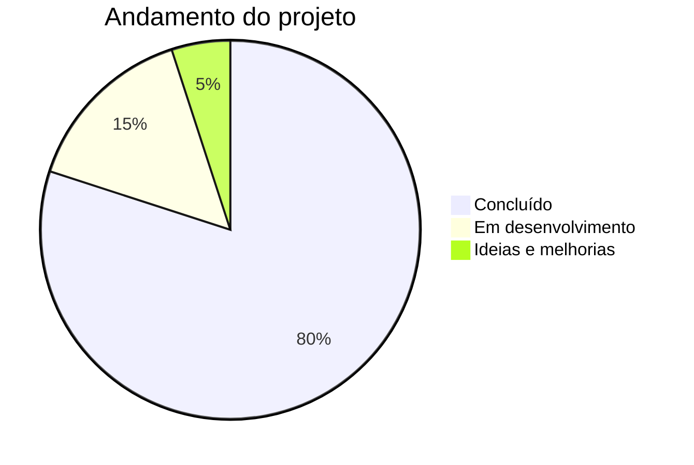

# Exercícios Físicos e Bem-Estar Físico e Mental

# Ata 1 – Projeto Integrador (Professor Mehran)

**Data:** 02/06/2026

**Coordenadora:** Beatriz Gomes

**Secretário e responsável pelo GitHub:** Julio César da Silva Kubiack

### Assunto

Organização das funções e distribuição das tarefas entre os integrantes do grupo.

**Ausências:** Não houve.

### Responsabilidades

- **Julio César da Silva Kubiack:** Realizar pesquisas aprofundadas sobre possíveis conteúdos para o site.

- **Beatriz Gomes dos Santos:** Pesquisar temas e conteúdos que poderão ser utilizados no projeto.

- **Beatriz Costa:** Desenvolver a estrutura inicial do site (wireframe), propondo ideias para as páginas.

- **Isabela Luiza Maciel:** Auxiliar na elaboração da estrutura do site e sugerir ideias para as páginas.

- **Melissa:** Buscar vídeos e outras fontes de mídia para utilização no projeto.

- **Todos os integrantes:** Contribuir com sugestões de layout, design e melhorias para o desenvolvimento do site.

---

# Ata 2 – Projeto Integrador (Professor Mehran)

**Data:** 09/06/2026

**Coordenadora:** Beatriz Gomes

**Secretário e responsável pelo GitHub:** Julio César da Silva Kubiack

### Assunto

Discussão sobre o desenvolvimento do Figma e organização das pesquisas.

**Ausências:** Não houve.

### Responsabilidades

- **Julio César da Silva Kubiack:** Continuação das pesquisas sobre os conteúdos do site.

- **Beatriz Gomes dos Santos:** Continuação das pesquisas dos conteúdos.

- **Beatriz Costa:** Desenvolvimento do projeto no Figma.

- **Isabela Luiza Maciel:** Organização das páginas, imagens e vídeos.

- **Melissa:** Pesquisa de vídeos e demais mídias.

---

# Ata 3 – Projeto Integrador (Professor Mehran)

**Data:** 16/06/2026

**Coordenadora:** Beatriz Gomes

**Secretário e responsável pelo GitHub:** Julio César da Silva Kubiack

### Assunto

Andamento do Figma e elaboração dos textos do site.

**Ausências:** Beatriz Costa.

### Responsabilidades

- **Julio César da Silva Kubiack:** Continuação das pesquisas.

- **Beatriz Gomes dos Santos:** Produção dos textos e pesquisa de modelos de wireframe.

- **Isabela Luiza Maciel:** Organização das páginas, imagens e vídeos.

- **Melissa:** Pesquisa de vídeos e fontes de mídia.

### Observações

Mesmo ausente, **Beatriz Costa** continuou responsável pelo desenvolvimento principal do Figma. As alunas **Isabela Luiza Maciel** e **Melissa** criaram uma segunda página no Figma para apresentar sugestões e auxiliar no trabalho. Enquanto isso, **Beatriz Gomes** ficou responsável pela produção dos textos e pela busca de referências para o wireframe.

---

# Ata 4 – Projeto Integrador (Professor Mehran)

**Data:** 23/06/2026

**Coordenadora:** Beatriz Gomes

**Secretário e responsável pelo GitHub:** Julio César da Silva Kubiack

### Assunto

Desenvolvimento do Figma e início da programação da página **index.html**.

**Ausências:** Beatriz Costa (participando de passeio escolar).

### Responsabilidades

- **Julio César da Silva Kubiack:** Desenvolvimento do Figma e da página **index.html**.

- **Beatriz Gomes dos Santos:** Auxílio no desenvolvimento do Figma.

- **Isabela Luiza Maciel:** Desenvolvimento do Figma.

- **Melissa:** Desenvolvimento do Figma.

---

# Ata 5 – Projeto Integrador (Professor Mehran)

**Data:** 30/06/2026

**Coordenadora:** Beatriz Gomes

**Secretário e responsável pelo GitHub:** Julio César da Silva Kubiack

### Assunto

Continuação do desenvolvimento do Figma, das páginas do site e organização do GitHub.

**Ausências:** Beatriz Costa (motivo não informado).

### Responsabilidades

- **Julio César da Silva Kubiack:** Organização e atualização do GitHub.

- **Beatriz Gomes dos Santos:** Desenvolvimento das páginas no Figma.

- **Isabela Luiza Maciel:** Desenvolvimento das páginas no Figma.

- **Melissa:** Desenvolvimento das páginas no Figma.

---

# Ata 6 – Projeto Integrador (Professor Mehran)

**Data:** 07/07/2026

**Coordenadora:** Beatriz Gomes

**Secretário e responsável pelo GitHub:** Julio César da Silva Kubiack

### Assunto

Finalização do Figma para a primeira avaliação parcial.

### Observação

Nesta reunião foi realizada a preparação para a **primeira avaliação parcial**, em que o professor Mehran avaliaria o desenvolvimento do Figma e a organização do GitHub.

### Responsabilidades

- **Julio César da Silva Kubiack:** Organização do GitHub.

- **Beatriz Gomes dos Santos:** Sugestões e melhorias para o Figma.

- **Beatriz Costa:** Finalização da versão definitiva do Figma.

- **Isabela Luiza Maciel:** Sugestões e melhorias para o Figma.

- **Melissa:** Sugestões e melhorias para o Figma.

---

# Ata 7 – Projeto Integrador (Professor Mehran)

**Data:** 14/07/2026

**Coordenadora:** Beatriz Gomes

**Secretário e responsável pelo GitHub:** Julio César da Silva Kubiack

### Assunto

Continuação do projeto e integração de um novo integrante ao grupo.

### Responsabilidades

- **Julio César da Silva Kubiack:** Organização e manutenção do GitHub.

- **Beatriz Gomes dos Santos:** Auxílio nas melhorias do Figma.

- **Beatriz Costa:** Finalização do layout do Figma.

- **Isabela Luiza Maciel:** Sugestões para o Figma.

- **Melissa:** Sugestões para o Figma.

### Observações

O aluno **Vinicios Korman** passou a integrar a equipe. Durante a reunião, foram apresentados o andamento do Projeto Integrador, os objetivos do site e as atividades já realizadas. Neste primeiro momento, o novo integrante está se familiarizando com o projeto. Suas responsabilidades serão definidas nas próximas reuniões, conforme o avanço das atividades.

---

# Ata 8.1 – Projeto Integrador (Professor Mehran)

## Fora da sala

**Data:** 15/07/2026

**Coordenadora:** Beatriz Gomes

**Secretário e responsável pelo GitHub:** Julio César da Silva Kubiack

### Assunto

Continuação do desenvolvimento do Projeto Integrador.

### Responsabilidades

- **Julio César da Silva Kubiack:** Organização e manutenção do repositório no GitHub, além do desenvolvimento da primeira página em HTML e CSS (index).

- **Beatriz Gomes dos Santos:** Auxílio nas melhorias do protótipo no Figma.

- **Isabela Luiza Maciel:** Sugestões e melhorias para o protótipo no Figma.

- **Melissa:** Sugestões e melhorias para o protótipo no Figma.

- **Vinicios Korman** (se integrando)

### Observações

Neste dia, os integrantes do grupo se reuniram fora da sala de aula para dar continuidade ao desenvolvimento e à finalização do protótipo no Figma, além de adiantar etapas do projeto, contribuindo para o cumprimento do cronograma estabelecido.

---

# Ata 8.2 – Projeto Integrador (Professor Mehran)

## Fora da sala

**Data:** 16/07/2026 ao dia 03/08/2026

**Coordenadora:** Beatriz Gomes

**Secretário e responsável pelo GitHub:** Julio César da Silva Kubiack

### Responsabilidades

- **Julio César da Silva Kubiack:** desenvolvimento da primeira página em HTML e CSS (index).

---

# Ata 9 – Projeto Integrador (Professor Mehran)

**Data:** 04/08/2026

**Coordenadora:** Beatriz Gomes

**Secretário e responsável pelo GitHub:** Julio César da Silva Kubiack

### Assunto

Arrumar o que está acontecendo com os commits e dar continuidade com as páginas em HTML e CSS (index).

**Ausências:** Beatriz Costa.

### Responsabilidades

- **Julio César da Silva Kubiack:** página em HTML e CSS (index).

- **Beatriz Gomes dos Santos:** página em HTML e CSS (index).

- **Isabela Luiza Maciel:** página em HTML e CSS (index).

- **Melissa:** página em HTML e CSS (index).

- **Vinicios Korman** (se integrando)

---


# Ata 9.1 – Projeto Integrador (Professor Mehran)

**Data:** 07/08/2026

**Coordenadora:** Beatriz Gomes

**Secretário e responsável pelo GitHub:** Julio César da Silva Kubiack

### Assunto

Aprender e executar banco de dados

### Observação

Esse passo apenas o aluno Julio está fazendo por conta própria

### Responsabilidades

- **Julio César da Silva Kubiack:** página em HTML e CSS (index).

---

# Ata 10 – Projeto Integrador (Professor Mehran)

**Data:** 11/08/2026

**Coordenadora:** Beatriz Gomes

**Secretário e responsável pelo GitHub:** Julio César da Silva Kubiack

### Assunto

Arrumar o que está acontecendo com os commits e dar continuidade com as páginas em HTML e CSS (index).


### Responsabilidades

- **Julio César da Silva Kubiack:** página em HTML e CSS (index).

- **Beatriz Gomes dos Santos:** página em HTML e CSS (index).

- **Isabela Luiza Maciel:** página em HTML e CSS (index).

- **Melissa:** página em HTML e CSS (index).

- **Vinicios Korman** Html

# Atas 11 – Projeto Integrador (Professor Mehran) (as dos dias 11 e 18 foram apenas continuação de html todos fizeram as mesmas coisas html)

**Data:** 25/08/2026

**Coordenadora:** Beatriz Gomes

**Secretário e responsável pelo GitHub:** Julio César da Silva Kubiack

### Assunto

Arrumar o que está acontecendo com os commits e dar continuidade com as páginas em HTML e CSS (index).

### Responsabilidades

- **Julio César da Silva Kubiack:** página em HTML e CSS (index).

- **Beatriz Gomes dos Santos:** página em HTML e CSS (index).

- **Isabela Luiza Maciel:** página em HTML e CSS (index).

- **Melissa:** página em HTML e CSS (index).

- **Beatriz Costa:** página em HTML e CSS (index).

- **Vinicios Korman** Html

---

### Observação

A seguir vai estar quais paginas cada integrante fez...

- **Julio César da Silva Kubiack:** página Sobre nós 

- **Beatriz Gomes dos Santos:** página Rotina, progresso

- **Isabela Luiza Maciel:** página Exercícios

- **Melissa:** página Início

- **Beatriz Costa:** página login 

- **Vinicios Korman** página formulário

# Atas 12 – Projeto Integrador (Professor Mehran)

**Data:** 29/08/2026

**Coordenadora:** Beatriz Gomes

**Secretário e responsável pelo GitHub:** Julio César da Silva Kubiack

### Assunto

Arrumar o que está acontecendo com os commits e dar continuidade com as páginas em HTML e CSS (index).

### Responsabilidades

- **Julio César da Silva Kubiack:** página em HTML e CSS (index).

- **Beatriz Gomes dos Santos:** página em HTML e CSS (index).

- **Isabela Luiza Maciel:** página em HTML e CSS (index).

- **Melissa:** página em HTML e CSS (index).

- **Beatriz Costa:** página em HTML e CSS (index).

- **Vinicios Korman** Html e CSS

---

### Observação

Sábado Letivo

# Atas 12.1 – Projeto Integrador (Professor Mehran)

### Observação

Nesta ata, o secretário do trabalho irá falar sobre o que foi feito até hoje.

Eu, Julio Kubiack, usei IA para arrumar as atas no dia 29/08/2026, com o objetivo de deixar tudo organizado, sem nenhum erro de digitação ou de síntese. Com isso, algumas coisas que foram arrumadas nos dias anteriores podem ter perdido seu principal objetivo, que é mostrar por que cada coisa foi feita.

Com isso, agora irei falar sobre o que foi feito durante essas 12 atas a seguir.

Nas atas, foi dito que a aluna Beatriz Costa fez o Figma e que as alunas auxiliaram ela. Porém, o que realmente aconteceu foi que as alunas Melissa, Beatriz Gomes e Isabela Maciel fizeram todo o Figma. Beatriz Costa também ajudou no Figma, porém sua participação foi mais como auxílio do que como responsável pelo desenvolvimento.

A aluna Beatriz Costa, que esteve presente auxiliando no projeto, também fez, com seu auxílio, a página de login.

A aluna Isabela Maciel esteve presente fazendo o Figma e a página de exercícios.

A aluna Melissa esteve presente na elaboração do Figma e fez a página inicial.

A aluna Beatriz Gomes atuou na formação do Figma e no desenvolvimento das páginas Progresso e Rotina.

O aluno Vinicios Korman, que entrou no grupo no meio do projeto, deu sua opinião sobre o Figma e fez a página Contate-nos.

O aluno Julio Kubiack atuou na parte de ensinar aos alunos um pouco sobre o GitHub, transmitindo seus conhecimentos aos demais integrantes. Também fez a página Sobre Nós, juntou e arrumou as páginas dos outros alunos e auxiliou e ajudou no Figma.

# Atas 13 – Projeto Integrador (Professor Mehran)

**Data:** 29/08/2026

**Coordenadora:** Beatriz Gomes

**Secretário e responsável pelo GitHub:** Julio César da Silva Kubiack

### Assunto

ultimos passos do CSS...
### Responsabilidades

- **Julio César da Silva Kubiack:** página em HTML e CSS (index).

- **Beatriz Gomes dos Santos:** página em HTML e CSS (index).

- **Isabela Luiza Maciel:** página em HTML e CSS (index).

- **Melissa:** página em HTML e CSS (index).

- **Beatriz Costa:** página em HTML e CSS (index).

- **Vinicios Korman** Html e CSS

---

### Observação

Aula do Kennedy

# ATA 13.1 — 14/09/2026 #

**Data: 14/09/2026**

**Coordenadora: Beatriz Gomes**

**Secretário e responsável pelo GitHub: Julio Kubiack**

### Atividades realizadas

Nesta reunião, continuamos o desenvolvimento do site do projeto. Trabalhamos principalmente na página “Sobre nós”, ajustando o HTML e o CSS para deixar a página mais parecida com o modelo feito no Figma.

Também foram feitos ajustes no header e footer, deixando os dois padronizados com as outras páginas do site. Foram realizados ajustes no tamanho das imagens, organização das seções e na responsividade para celular e desktop.

Além disso, foram corrigidos detalhes da seção “Etapas do desenvolvimento”, principalmente as caixas azuis com os textos, para ficarem mais próximas do modelo do Figma.

***Responsabilidades:***

***Julio Kubiack***: organização do HTML e CSS da página “Sobre nós”, ajustes de responsividade e organização do GitHub

### Progresso do projeto


``` 
O projeto está aproximadamente 70% concluído. Ainda existem algumas partes em desenvolvimento e algumas ideias que podem ser adicionadas futuramente.
```
# Ata 13.2 – Projeto Integrador (Professor Mehran)

**Data:** 19/09/2026

**Coordenadora:** Beatriz Gomes

**Secretário e responsável pelo GitHub:** Julio César da Silva Kubiack

### Assunto

Correção do envio do formulário de Contate-nos (Supabase) e implementação de sistema de recuperação de senha sem envio de e-mail.

### Responsabilidades

- **Julio César da Silva Kubiack:** identificação e correção do erro de permissão (RLS) que impedia o envio do formulário de Contate-nos — o problema estava no uso de `.select()` junto do `.insert()`, que exigia uma política de leitura inexistente na tabela `contatos_db`; criação de uma Edge Function no Supabase (`quick-endpoint`) para permitir a redefinição de senha de usuários sem depender de envio de e-mail de verificação, já que o projeto não possui esse serviço configurado; a função confere se o nome e o e-mail informados batem com os dados salvos na tabela `usuarios_db` e, em caso positivo, atualiza a senha diretamente pelo Supabase Auth; criação da página `recuperar-senha.html` e do script `recuperarSenha.js`, responsáveis por coletar nome, e-mail e nova senha e chamar a Edge Function; ajuste da configuração da função para desativar a exigência de verificação de JWT (Enforce JWT Verification), permitindo que ela seja chamada por usuários ainda não autenticados.

---

### Observação

O formulário de Contate-nos está funcionando corretamente e salvando as mensagens na tabela `contatos_db`. A recuperação de senha também foi testada com sucesso. Pendências que seguem em aberto: replicar os ajustes de header, avatar e menu nas demais páginas do site; decidir sobre a criação de uma página de Política de Privacidade; revisar o sistema de metas da página Progresso. tudo isso foi feito com a ideias minha, porem com o auxilio da ia "claude" mostrando e ensinando como fazia cada passo do codigo.

**Fora da sala**

# Atas 11 – Projeto Integrador (Professor Mehran) (Projeto em andamento, apenas fazendo mudanças no css nas páginas.)

**Data:** 22/09/2026

**Coordenadora:** Beatriz Gomes

**Secretário e responsável pelo GitHub:** Julio César da Silva Kubiack

### Assunto

Todos arrumando o css de cada página ou ajudando respectivamente as outras páginas dos outros colegas.

### Responsabilidades

- **Julio César da Silva Kubiack:** planejamento de ideias para aprimorar a intereção do site.

- **Beatriz Gomes dos Santos:** arrumando o css das páginas progresso e rotina.

- **Isabela Luiza Maciel:** arrumando o css da página contate-nos.

- **Melissa:** arrumando o css da página do início.

- **Beatriz Costa:** arrumando o css rotina progresso e perfil.

- **Vinicios Korman** arrumando o footer e o header na página do contate-nos.

---
